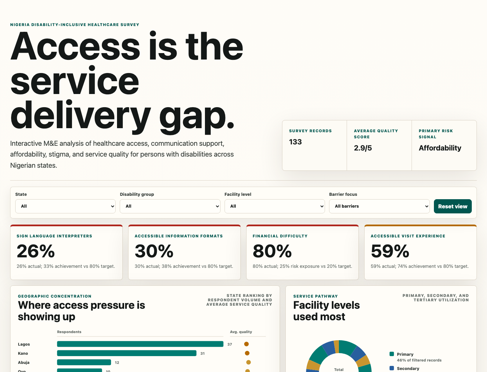

# Health Access for Persons with Disabilities

Interactive M&E dashboard analyzing healthcare access barriers reported by persons with disabilities in Nigeria.



## Overview

This project turns survey responses into a donor-ready visual analysis of disability-inclusive healthcare access. It focuses on the practical questions that matter for program managers, M&E leads, and decision makers:

- Where are access barriers most visible?
- Which facility levels are respondents using?
- How far are key inclusion indicators from target?
- Which disability groups face the highest barrier exposure?
- What corrective actions should be prioritized next?

## Dashboard Features

- Interactive filters for state, disability group, facility level, and barrier focus
- KPI cards showing actual values first, followed by performance vs target
- State ranking by respondent volume and average quality score
- Facility utilization donut chart
- Barrier performance chart with an 80% target reference line
- Disability group and barrier exposure heatmap
- Quality-of-care rating distribution
- Monthly survey response trend
- Qualitative recommendation theme bubbles
- Risk callouts and executive action recommendations

## How to Open

This is a static web dashboard. Open `index.html` directly in a browser, or run a local server:

```bash
python3 -m http.server 4173
```

Then visit:

```text
http://127.0.0.1:4173
```

## Files

- `index.html` - dashboard structure and content sections
- `styles.css` - visual design, responsive layout, and chart styling
- `src/main.js` - data normalization, filters, KPI calculations, and SVG chart rendering
- `assets/dashboard-screenshot.png` - dashboard screenshot for documentation

## Data Note

Dashboard figures are generated from a cleaned and normalized respondent-level version of the supplied survey responses. Percentages describe this respondent sample and are intended for M&E diagnosis, prioritization, and donor discussion rather than population prevalence estimation.

## Strategic Reading

The strongest risk signals are communication support, physical accessibility, and affordability. Sign language interpretation, accessible materials, ramps, elevators, accessible toilets, queue management, and subsidy design should be treated as core service-readiness issues rather than optional accommodations.
